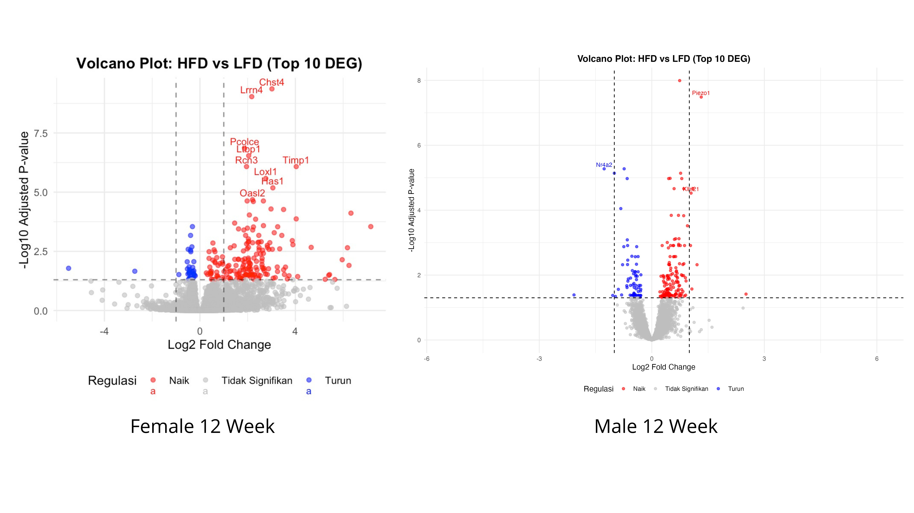
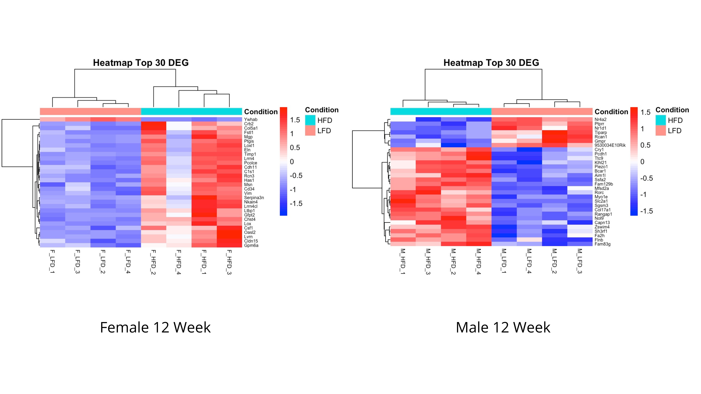
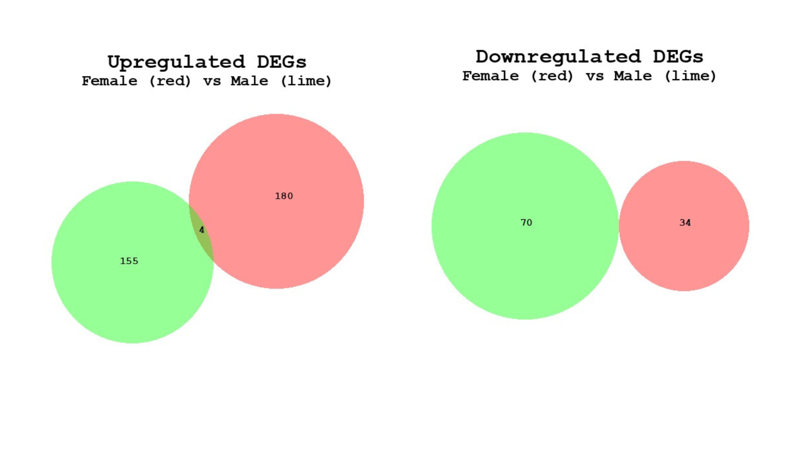

# rnaseq-hfd-vs-lfd-urothelium
This repository contains my mini project completed as part of the RNA-seq Bioinformatics Bootcamp organized by INBIO Indonesia. The project reproduces and extends the transcriptomic analysis of mouse urothelium exposed to a high-fat diet using publicly available GEO datasets.

## Comparative RNA-seq Analysis of Mouse Urothelium Following High-Fat Diet

Obesity is recognized as a risk factor for urinary tract infection (UTI), but the molecular mechanisms underlying this association remain incompletely understood.

This mini project investigates transcriptomic alterations in mouse urothelium following High-Fat Diet (HFD) treatment compared with Low-Fat Diet (LFD) using the publicly available RNA-seq dataset **GSE294660** from the Gene Expression Omnibus (GEO).

The objective is to identify differentially expressed genes (DEGs) associated with HFD exposure and compare the molecular response between female and male mice.

## Objectives
- Perform RNA-seq differential expression analysis using DESeq2.
- Identify genes significantly altered by HFD.
- Visualize transcriptomic differences using PCA, volcano plot, and heatmap.
- Compare female and male DEGs using Venn analysis.
- Highlight potential obesity-associated genes involved in urothelial responses.

## Experimental Design
|  Group  | Samples  |
|---------|----------|
|  Female LFD  |  4  |
|  Female HFD  |  4  |
|  Male LFD  |  4  |
|  Male HFD  |  4  |

This project demonstrated the analysis using the **female dataset**, while the same workflow can be applied to the male samples for comparative analysis.

## Workflow
<p align="center">
  
</p>

## Pipeline Analysis 
### 1. Data Preparation
The raw count matrix was downloaded from GEO supplementary files. Steps included:
- Download GEO dataset
   ```r
  library(GEOquery)
  gse <- getGEO("GSE294660", GSEMatrix = TRUE)
  ```
- Import raw count matrix
- Extract female/male samples
- Create sample metadata
- Check sample distribution
- Filter low-count genes

### 2. Quality Control
Quality assesment was performed before differential expression analysis. Visualization include:
- Boxplot
- Sample correlation heatmap
- Principal Component Analysis (PCA)
These analyses evaluate sequencing consistency and sample clustering.

### 3. Data Normalization
Normalization was performed using DESeq2. Methods:
- Estimate size factor
- Variance Stabilizing Transformation (VST)
- Regularized Log Transformation (rlog)
Normalized data were used for visualization.

### 4. Differential Expression Analysis
Differential expression analysis was performed using DESeq2.
Comparison:
  Female HFD vs Female LFD
  or
  Male HFD vs Male LFD
Genes were considered **"significant"** when adjusted p-value (padj) < 0.05. Each gene was classified as: 

**Upregulated**, **Downregulated**, and **Not significant**.

### 5. Visualization 
The following visualization were generated.
### a. Volcano Plot
Displays significant upregulated and downregulated genes.

<p align="center">
  
</p>

##### **Figure 1. Volcano plot of differentially expressed genes.**

### b. Heatmap
Show expression pattern of the top 30 differentially expressed genes
<p align="center">
  
</p>

##### **Figure 2. Heatmap of top 30 differentially expressed genes.**

### c. Top Differentially Expressed Genes
- Top 10 Upregulated Genes
  
| **Female** | **log2FoldChange** | **Male** | **log2FoldChange** |
|------------|-------------------:|----------|-------------------:|
| Serpina3n | 7.158967 | Fn1 | 2.5113245 |
| Lox | 6.327878 | Piezo1 | 1.3169382 |
| Ccdc8 | 6.246176 | Krt6a | 1.2051311 |
| Mmp19 | 6.181378 | Mfsd2a | 1.0939635 |
| F13a1 | 5.960811 | Rnf187 | 1.0677453 |
| Mylk3 | 5.652402 | Klhl21 | 1.0464326 |
| Mkx | 5.431441 | Tle1 | 1.0310945 |
| Snca | 5.396666 | Rorc | 0.9499998 |
| Prg4 | 5.247815 | Krt13 | 0.9123555 |
| Csdc2 | 4.661899 | Gclm | 0.9016403 |

- Top 10 Downregulated Genes

| **Female** | **log2FoldChange** | **Male** | **log2FoldChange** |
|------------|-------------------:|----------|-------------------:|
| Pcdhb8 | -5.5028044 | Cyp1a1 | -2.0746442 |
| Esrrg | -2.7285762 | Nr4a2 | -1.2708240 |
| Zfp775 | -0.8821008 | Cyp1b1 | -1.0428094 |
| Wdr7 | -0.5324458 | Tiparp | -0.9992945 |
| Gsta2 | -0.5253585 | Cpm | -0.9699426 |
| Krt20 | -0.5038250 | Rps21 | -0.8922742 |
| Sprr2a3 | -0.4922030 | Gmpr | -0.8268962 |
| Ccdc115 | -0.4774070 | Atf3 | -0.8056483 |
| Tgfa | -0.4559333 | Rps29 | -0.7793045 |
| Rab31 | -0.4540516 | Pld1 | -0.7461504 |

### Female vs Male Comparison
Differentially expressed genes from female and male analyses were compared using Venn diagrams.

<p align="center">
  
</p>

##### **Figure 3. Venn diagram of differentially expressed genes.**
- Female ∩ Male Upregulated = Fn1, Fn2, Fn3, Fn3.
- Female ∩ Male Downregulated  = NA

The overlapping genes represent transcriptomic responses shared between sexes.

## KEY FINDINGS
Differentially expressed genes (DEGs) were identified using the criteria of adjusted p-value (padj) < 0.05 and |log2FoldChange| > 1.

Female:
- Upregulated genes: 184
- Downregulated genes: 34

Male:
- Upregulated genes: 159
- Downregulated genes: 70

Venn analysis was performed separately for upregulated and downregulated genes to identify genes shared between female and male mice.
Atau jika ingin lebih ringkas untuk README GitHub:

## Biological Interpretation
Several highly expressed genes identified in this analysis have previously been associated with:
- Extracellular matrix remodeling
- Inflammatory response
- Tissue repair
- Mechanical stress
- Urothelial integrity

These findings suggest that HFD induces transcriptional changes potentially contributing to obesity-associated urinary tract dysfunction.

## Software
- R
- DESeq2
- GEOquery
- ggplot2
- pheatmap
- dplyr
- tidyr

## Reference
- GEO Dataset GSE294660
- Schwartz L, Salamon K, Simoni A, Cotzomi-Ortega I, Sanchez-Zamora Y, Linn-Peirano S, John P, de Dios Ruiz-Rosado J, Jackson AR, Wang X, Spencer JD. Obesity promotes urinary tract infection by disrupting bladder focal adhesion kinase signaling. iScience. 2025 Oct 25;28(11):113862. doi: 10.1016/j.isci.2025.113862. PMID: 41280678; PMCID: PMC12637249.
